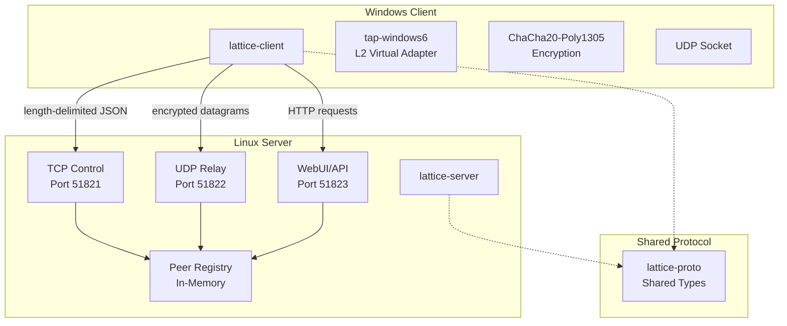
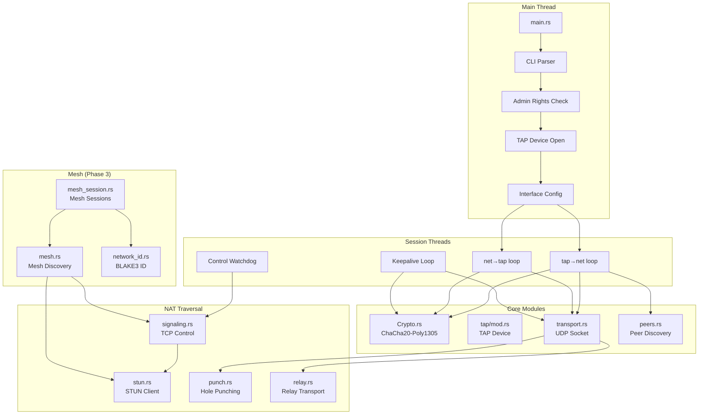
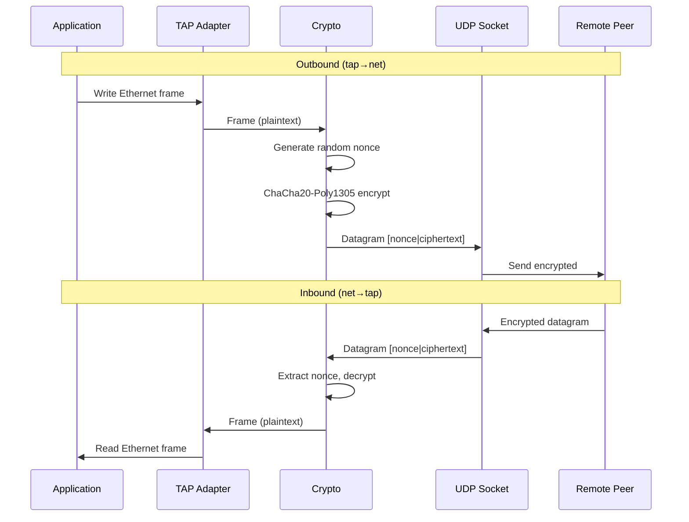
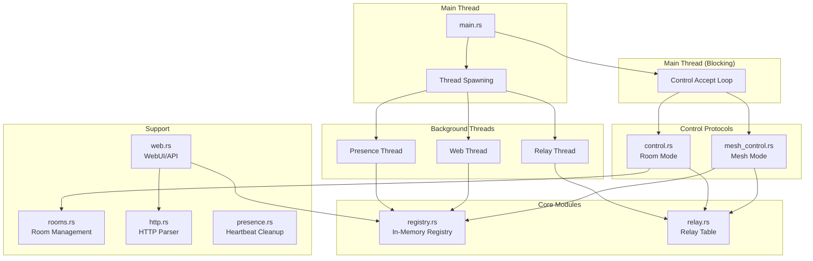
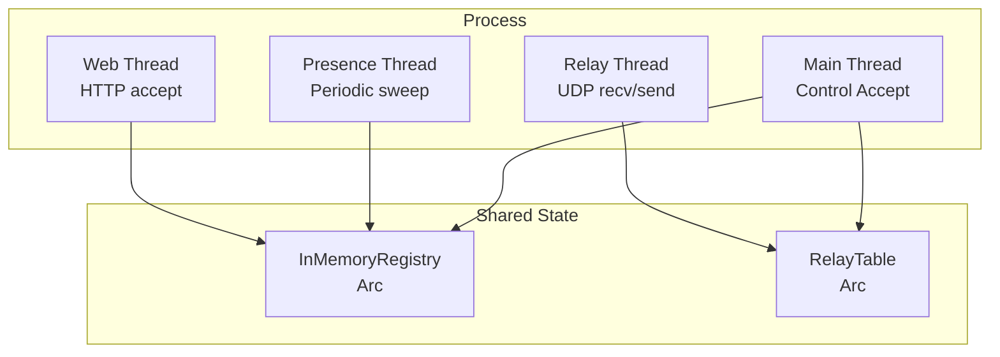
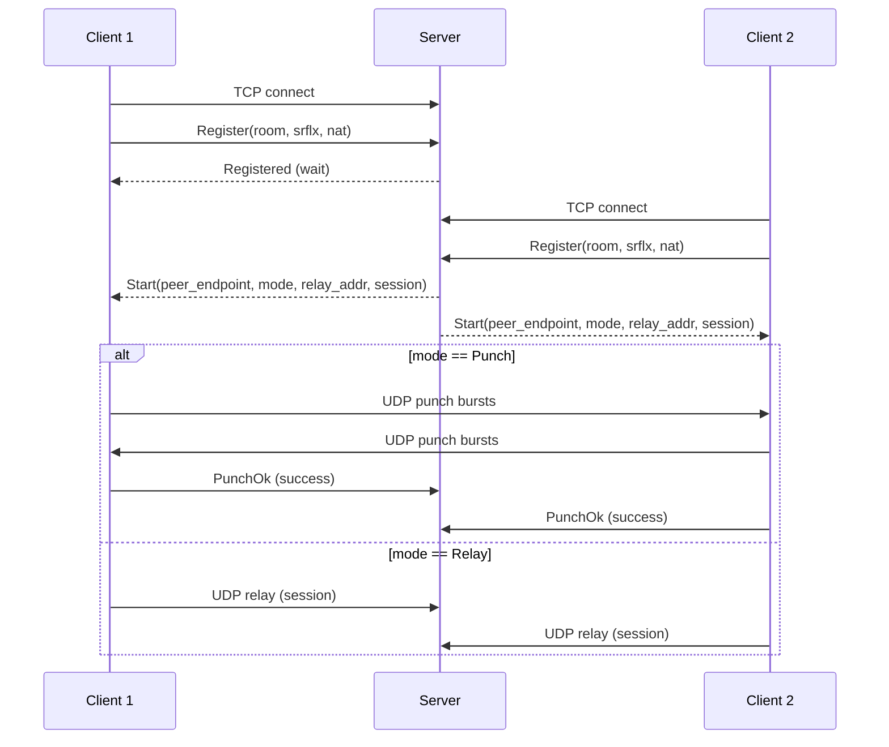
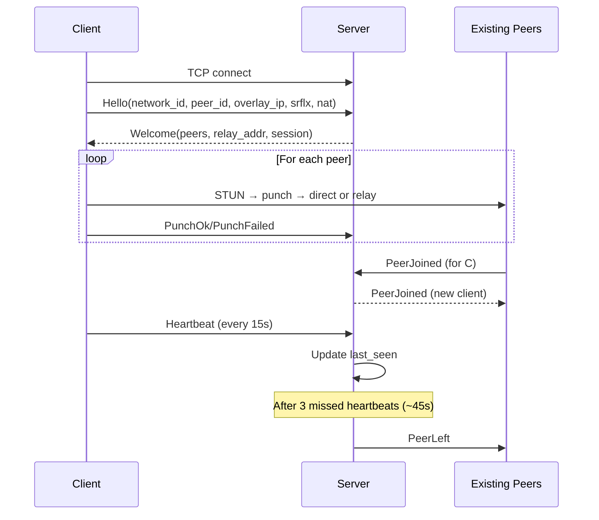
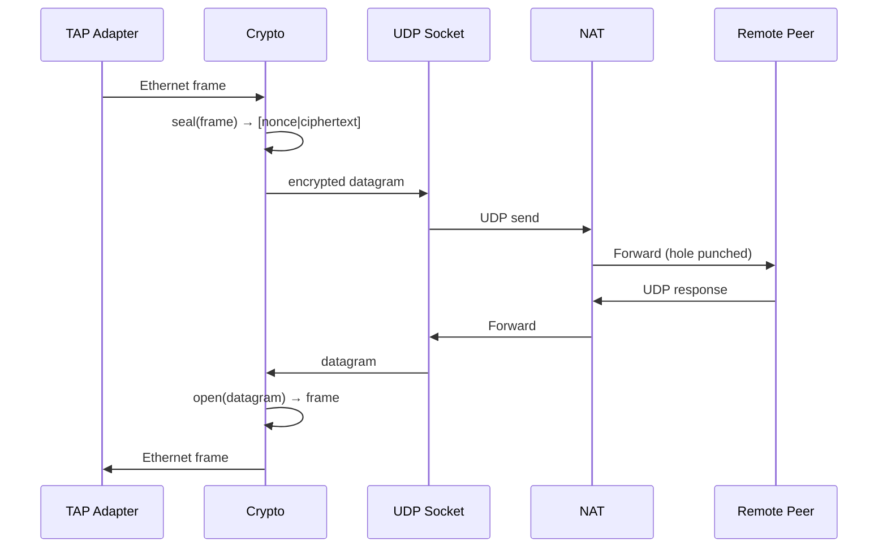
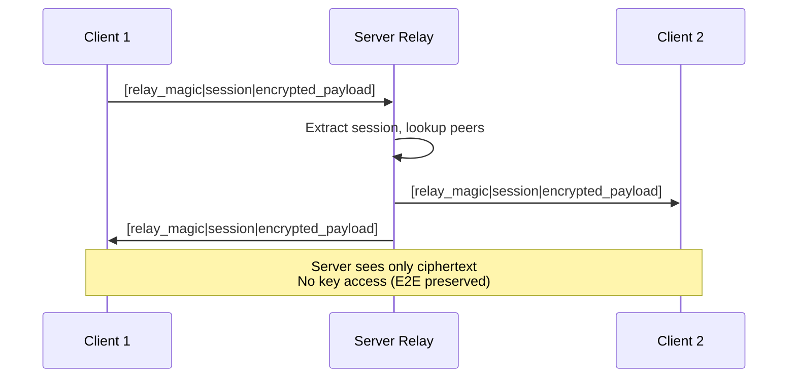

# Lattice Architecture Diagram

## Project Overview

Lattice is a lightweight overlay network for LAN gaming that creates a virtual local network over the internet. It's designed as an alternative to Hamachi/RadminVPN/ZeroTier but without WireGuard (to avoid DPI signature detection).

**Key Design Decisions:**
- **L2 (TAP) not L3 (TUN):** Uses tap-windows6 for real Ethernet broadcast/multicast → LAN discovery works out of the box
- **Custom UDP Protocol:** No WireGuard signature to evade Russian DPI
- **Phase 3:** Coordination server with mesh support for N peers
- **Cross-platform:** Windows client + Linux server deployment

---

## High-Level Architecture



---

## Workspace Structure

```
lattice/
├── Cargo.toml                    # Workspace config
├── SPEC.md                       # Architecture spec
├── AGENTS.md                     # Non-negotiable decisions
├── crates/
│   ├── lattice-client/           # Windows-only client
│   │   ├── src/
│   │   │   ├── main.rs           # Entry point, CLI parsing
│   │   │   ├── crypto.rs         # ChaCha20-Poly1305 AEAD
│   │   │   ├── tap/              # Windows FFI (unsafe isolated)
│   │   │   │   ├── mod.rs        # TAP device abstraction
│   │   │   │   ├── registry.rs   # Find tap-windows6 in registry
│   │   │   │   └── win32.rs      # Win32 API calls
│   │   │   ├── transport.rs      # UDP transport trait
│   │   │   ├── peers.rs          # Peer discovery trait
│   │   │   ├── netcfg.rs         # IP/MTU configuration
│   │   │   ├── stun.rs           # STUN endpoint discovery
│   │   │   ├── signaling.rs      # TCP control channel
│   │   │   ├── punch.rs          # UDP hole punching
│   │   │   ├── relay.rs          # Relay transport fallback
│   │   │   ├── dynamic.rs        # Dynamic connection setup
│   │   │   ├── session.rs        # Data plane loops
│   │   │   ├── mesh.rs           # Mesh peer management
│   │   │   ├── mesh_session.rs   # Mesh session logic
│   │   │   ├── network_id.rs     # BLAKE3 network ID
│   │   │   ├── cli.rs            # CLI argument parsing
│   │   │   └── run.rs            # Mode dispatch
│   │   └── Cargo.toml
│   ├── lattice-server/           # Cross-platform server
│   │   ├── src/
│   │   │   ├── main.rs           # Entry point, thread spawning
│   │   │   ├── control.rs        # Room mode control (Phase 2)
│   │   │   ├── mesh_control.rs   # Mesh mode control (Phase 3)
│   │   │   ├── registry.rs       # Peer registry (trait-based)
│   │   │   ├── rooms.rs          # Room management (Phase 2)
│   │   │   ├── relay.rs          # UDP relay server
│   │   │   ├── web.rs            # WebUI/API server
│   │   │   ├── http.rs           # HTTP/1.1 parser
│   │   │   ├── presence.rs       # Heartbeat cleanup
│   │   │   └── lib.rs            # Module exports
│   │   ├── tests/
│   │   └── Cargo.toml
│   └── lattice-proto/            # Shared protocol types
│       ├── src/
│       │   ├── lib.rs            # Module exports
│       │   ├── control.rs        # Phase 2 messages
│       │   ├── mesh.rs           # Phase 3 messages
│       │   ├── ids.rs            # Newtype IDs (PeerId, etc.)
│       │   ├── relay.rs          # Relay wrapper format
│       │   └── framing.rs        # Length-delimited framing
│       └── Cargo.toml
```

---

## Client Architecture (lattice-client)



### Client Data Flow



---

## Server Architecture (lattice-server)



### Server Thread Model



---

## Protocol Architecture (lattice-proto)

```mermaid
graph TB
    subgraph "Protocol Messages"
        Control[control.rs<br/>Phase 2 Messages]
        Mesh[mesh.rs<br/>Phase 3 Messages]
    end
    
    subgraph "Shared Types"
        IDs[ids.rs<br/>Newtype IDs]
        Relay[relay.rs<br/>Relay Format]
    end
    
    subgraph "Framing"
        Framing[framing.rs<br/>Length-Delimited]
    end
    
    Control --> IDs
    Mesh --> IDs
    Relay --> IDs
    
    Control -.-> Framing
    Mesh -.-> Framing
```

### Message Types

**Phase 2 (Room Mode - 2 peers):**
- `ClientMessage::Register` - Join room
- `ClientMessage::PunchFailed` - Fallback to relay
- `ClientMessage::PunchOk` - Success report
- `ClientMessage::Bye` - Clean shutdown
- `ServerMessage::Registered` - Wait for peer
- `ServerMessage::Start` - Peer found, begin session
- `ServerMessage::PeerGone` - Peer left
- `ServerMessage::Error` - Rejection

**Phase 3 (Mesh Mode - N peers):**
- `MeshClientMessage::Hello` - Join network
- `MeshClientMessage::Heartbeat` - Keepalive
- `MeshClientMessage::PunchOk` - Direct path established
- `MeshClientMessage::PunchFailed` - Relay path
- `MeshClientMessage::Bye` - Clean shutdown
- `MeshServerMessage::Welcome` - Network accepted
- `MeshServerMessage::PeerJoined` - New peer
- `MeshServerMessage::PeerLeft` - Peer left
- `MeshServerMessage::PeerUpdated` - Endpoint changed
- `MeshServerMessage::Kicked` - Admin kick
- `MeshServerMessage::NetworkClosed` - Network closed
- `MeshServerMessage::Error` - Rejection

---

## Connection Establishment Flow

### Phase 2 (Room Mode)



### Phase 3 (Mesh Mode)



---

## Data Plane Flow

### Direct Connection (Hole Punching)



### Relay Connection (Fallback)



---

## Key Design Patterns

### Trait-Based Abstractions

```rust
// Transport abstraction (swappable for Phase 4 QUIC)
trait Transport {
    fn send(&self, addr: SocketAddr, data: &[u8]) -> Result<(), TransportError>;
    fn recv(&self, buf: &mut [u8]) -> Result<(usize, SocketAddr), TransportError>;
}

// Discovery abstraction (static vs STUN vs mesh)
trait Discovery {
    fn peers(&self) -> Result<Vec<SocketAddr>, DiscoveryError>;
}

// Registry abstraction (in-memory vs future SQLite)
trait Registry {
    fn register(&self, peer: PeerInfo) -> Result<()>;
    fn get_peers(&self, network_id: NetworkId) -> Result<Vec<PeerInfo>>;
    // ...
}
```

### FFI Isolation

All `unsafe` code and Win32 API calls are isolated in `lattice-client/src/tap/`:
- `tap/mod.rs` - Safe TAP device abstraction
- `tap/registry.rs` - Registry enumeration
- `tap/win32.rs` - Raw Win32 calls (only `unsafe` location)

### No Windows Dependency on Server

Server deliberately avoids `tokio`/`hyper`/`axum` because they transitively pull `windows-sys` on Windows dev machines. Uses:
- `std::net::TcpListener` for control/web
- `std::net::UdpSocket` for relay
- Manual HTTP/1.1 parsing in `http.rs`

---

## Cryptography

### Datagram Format

```
[ nonce: 12 bytes ][ ChaCha20-Poly1305(ethernet_frame): N+16 bytes ]
```

- **Nonce:** Random per-frame (OsRng) - no counter synchronization needed
- **AEAD:** ChaCha20-Poly1305 provides confidentiality + authentication
- **Tag:** 16-byte Poly1305 authenticator detects tampering
- **MTU:** TAP MTU ~1380 to avoid fragmentation after encapsulation

### Key Management

- **Phase 1-2:** Pre-shared key (32-byte hex from CLI)
- **Phase 3:** Still pre-shared, but `network-id = BLAKE3(key)` sent to server
- **Server:** Never sees the key, only the hash (E2E preserved)

---

## Phase Progression

| Phase | Features | Status |
|-------|----------|--------|
| **Phase 1** | Static mesh, direct UDP only | ✅ Complete |
| **Phase 2** | NAT traversal, STUN, hole punching, relay | ✅ Complete |
| **Phase 3** | Coordination server, mesh N peers, WebUI | ✅ Current |
| **Phase 4** | Transport obfuscation (QUIC) | 🚧 Future |

---

## Dependencies

### lattice-client
- `windows-sys` - Win32 API (Windows-only)
- `chacha20poly1305` - AEAD encryption
- `rand` - Cryptographic RNG for nonces
- `blake3` - Network ID computation
- `lattice-proto` - Shared protocol types
- `clap` - CLI parsing
- `serde_json` - Control channel serialization

### lattice-server
- `lattice-proto` - Shared protocol types
- `serde` + `serde_json` - Serialization
- `clap` - CLI parsing
- `env_logger` - Logging (no default features to avoid `windows-sys`)
- **No tokio/hyper/axum** - Uses std threads

### lattice-proto
- `serde` - Serialization (no std by default)
- **No platform dependencies** - Pure serde types

---

## Security Properties

1. **E2E Encryption:** Server relay sees only ciphertext
2. **AEAD Authentication:** Invalid packets rejected silently
3. **Random Nonces:** No nonce reuse (cryptographic RNG)
4. **No Key Exposure:** Server never sees shared key (only BLAKE3 hash)
5. **No WireGuard Signature:** Custom protocol evades DPI
6. **Admin-Only WebUI:** Localhost-only by default, explicit `--web-expose` required

---

## Performance Considerations

- **MTU ~1380:** Avoids IP fragmentation after encapsulation
- **Blocking I/O:** std threads sufficient for coordination server load
- **In-Memory Registry:** No persistence overhead (clients re-register)
- **Keepalive ~20s:** Below NAT timeout (30-60s)
- **Heartbeat ~15s:** Server marks offline after 3 misses (~45s)
